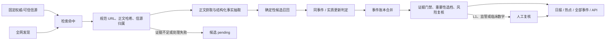

# 将 MCED 竞品监测重构为增量、证据优先的分层处理流水线

当前监测脚本把面向 20 个监测对象的多引擎搜索结果直接合并，按采集器生成的 `id` 去重，再以同公司标题 Jaccard 相似度聚类；`monitor-state.json` 只写入运行时间而不参与下一次运行。2026-08-19 日报的 327 条命中中，89 条落在 40 组重复规范 URL 内，165 条没有日期，83 条故事线已早于窗口，相邻两次运行仍有 262 个相同规范 URL；LLM 仅处理热度前 12 条，并用单一提示词把“相关性”同时当作“重要性”。因此本次重构优先修复事件身份、历史边界和决策可解释性，不改变现有站点视觉风格。

## 已决定：发布面与发现面分离

系统采用精度优先的发布边界：固定权威信源是正式监控与直接发布入口；全网搜索保留，但只用于发现候选情报，不能直接进入日报。候选情报只有在命中权威原始信源，或得到至少两个可信且相互独立的白名单信源交叉确认后，才能升级为发布事件。监管与科研结论必须回到监管机构、论文数据库、期刊或会议官网等原始证据。

这不是“只监控指定信源”和“继续扫描全网”的二选一：白名单保障发布精度，全网搜索负责发现白名单缺口。搜索引擎命中次数不再等同于独立信源数，同一 URL 的跨引擎重复命中也不再提高热度。

## 已决定：事件账本独立于展示窗口

系统永久保留事件身份及其证据关系；31 天窗口只控制页面查询范围和摘要素材，不参与判断一个事件是否已经出现。每次采集结果归入以下四种历史语义：

1. **首次发布**：未出现过且满足证据门槛的事件，进入当期日报。
2. **实质更新**：已有事件新增关键数字、研究结论、监管状态或原始证据，更新原事件并再次进入日报。
3. **重复证据**：新增转载或信源但没有新事实，只追加证据，不再次发布，也不因搜索引擎数量增加热度。
4. **过期回填**：事件发生时间早于监控基线，只补充档案，不进入当期日报。

日报是首次发布与实质更新的当期投影；完整事件账本服务于热点页、全部条目、API 与历史查询。界面保持现有布局，仅在已有徽章位置区分“新”和“更新”。事件时间优先采用原始信源给出的发生或发布日期；采集时间只记录系统何时发现它，不能伪装成事件时间。

## 已决定：重要性、等级与证据置信度分离

模型不得直接生成不可解释的 0–100 总分。它只能依据结构化证据为三个维度选择离散档位并说明依据，应用程序负责相加：

| 维度 | 可选分值 | 含义 |
| --- | --- | --- |
| 早筛竞争相关性 | 0 / 10 / 20 / 30 | 从无关、外围相关到直接影响 MCED 或目标产品 |
| 竞争影响 | 0 / 15 / 30 / 40 / 50 | 从日常传播到会改变产品、临床、监管或市场格局的里程碑 |
| 对世和的行动价值 | 0 / 10 / 20 | 从无需行动到需要立即分析、验证或响应 |

档位含义固定如下，提示词不得自行改写：相关性 0/10/20/30 分别表示无关、肿瘤领域外围相关、癌症筛查直接相关、直接涉及 MCED 或受监测产品；竞争影响 0/15/30/40/50 分别表示噪音、日常传播或小幅更新、值得纳入竞品档案的实质变化、重大临床/监管/商业进展、足以改变竞争格局的里程碑；行动价值 0/10/20 分别表示无需行动、需要持续跟踪或更新对照、需要立即分析或响应。

总分只决定情报等级：L1 为 80–100，进入头条并等待人工复核；L2 为 60–79，进入日报；L3 为 40–59，仅进入全部事件页；低于 40 不发布，但保留候选记录。涉及监管结论、临床性能数字或 L1 的事件，在人工确认前不能进入头条或日报，但后台归档不被阻塞。

证据置信度不参与重要性加总：权威原始信源为 High；两个可信且独立的白名单信源为 Medium；证据不足为 Low，仍是候选情报。事件的首次发布、实质更新、重复证据或过期回填状态同样独立于重要性分数。前端可继续使用现有分数位置，但标签从含混的“相关性”改为“重要性”，并在现有元信息区显示等级、证据置信度及三项得分依据。

## 已决定：固定模型职责，按风险选择性 MoA

V1 不建设能任意配置供应商、模型和工作流的通用路由器，只维护一张固定任务映射和少量升级条件。确定性程序优先于模型，模型只处理语言、语义和综合判断：

| 工作流环节 | 默认处理 | 升级或复核 |
| --- | --- | --- |
| 指定信源采集、候选发现、URL 规范化、正文哈希 | 程序 | 无 |
| 内容预筛与 MCED 相关性判断 | Qwen3.8-Flash | 返回不确定时由 GLM-5.3-Flash 独立复核 |
| 事实、公司、产品、事件类型和日期抽取 | Qwen3.8-Flash + 严格 JSON Schema | 监管/临床事实由 GLM-5.3-Flash 独立复核 |
| 图片、扫描件、图表或正文抓取失败 | DeepSeek V4 Flash Vision Exp | 高风险结论再交 GLM-5.3-Flash 复核 |
| 中文处理、摘要和关注理由 | Qwen3.8-Flash | L1 精选说明可由 Kimi K3 综合 |
| 规范 URL、正文哈希与事件指纹的确定性去重 | 程序 | 无 |
| 模糊事件匹配与实质更新识别 | Qwen3.8-Flash | 不确定或高风险时 Qwen 与 GLM 独立判断；冲突交 Kimi K3 仲裁 |
| 重要性三个维度选档 | Qwen3.8-Flash | L1、监管、临床数字由 GLM 独立复核；程序相加总分 |
| 日报排序与等级门槛 | 程序规则 | 无 |
| 日报、周报、月报的跨事件综合 | Kimi K3，只读取已核验的结构化事件 | 不允许重新解释未核验证据 |

MoA 只在四种条件触发：模型明确返回不确定；事件可能为 L1；涉及监管结论或临床性能数字；Qwen 与 GLM 结论冲突。独立复核时 GLM 不先读取 Qwen 的结论，避免锚定；只有仲裁阶段才把原始证据和两份结构化判断一并交给 Kimi。每次模型结果必须记录供应商、模型 ID、提示词版本、Schema 版本和生成时间，以便追溯与重跑。

V1 不接入参考工作流中的 `text-embedding-v4`。当前规模先用规范 URL、正文哈希及“公司 + 产品 + 事件类型 + 事件日期”指纹召回候选对，再让模型处理模糊项；只有固定验收集证明跨语言或改写标题仍造成不可接受的漏聚类时，才增加 embedding 召回层。

## 已决定：使用 Git 管理的单一 JSON 事件账本

V1 继续采用仓库内文件和 GitHub Actions 单写者，不引入 SQLite、Postgres、Redis 或外部状态服务。`scripts/monitor-ledger.json` 是唯一事实源，至少保存 Schema 版本、监控基线、最后成功运行时间、稳定事件 ID、事实版本、证据关系、历史状态、重要性依据、证据置信度、人工复核状态和模型审计信息。`scripts/monitor-state.json` 的单独水位职责并入账本。

`public/monitor/daily-report.json` 不再承担历史状态，只是由账本生成、可随时重建的公开读模型。生成器保持现有页面与 API 所需字段，并以新增字段提供“新/更新”、L1–L3、证据置信度和评分明细，避免重做界面。`scripts/monitor-history.jsonl` 继续只记录每次任务的数量、耗时和错误，不能用于事件去重。

每次任务先完整读取并校验账本，在内存中完成合并，再通过临时文件原子替换；账本校验或写入失败时不得覆盖最后一份有效账本和公开报告。GitHub Actions 的现有并发锁保证单写，成功后继续把账本、公开报告和运行历史一并提交。只有出现并发写入、站内在线编辑，或经测量确认文件规模拖慢任务后，才评估数据库迁移。

## 已决定：失败关闭、局部继续且不静默替换模型

流水线按候选隔离失败。单个采集信源失败时，其他信源继续处理，账本中的既有事件不得被删除；Qwen、DeepSeek 或 GLM 失败时，对应候选保持 `pending`，不得绕过缺失步骤发布，也不得自动切换到另一模型冒充既定流程。Kimi 失败只取消当期跨事件综合，已经核验的 L1/L2 事件仍可按各自状态发布。人工复核未完成的高风险事件保留在后台，但不进入头条或日报。

账本读取、Schema 校验或原子写入失败属于整次运行的致命错误：任务必须终止，并保留最后一份有效账本和公开报告。所有局部失败在后续运行重试，运行历史记录候选 ID、实际供应商、模型 ID、失败阶段、错误类别和重试次数。任何备用模型只有在固定验收集上证明满足同一契约后，才能通过新的明确决策加入；不得把“请求成功”当作结果等价。

## 目标工作流



工作流必须先确定事件与证据，再评分和写摘要；不能继续沿用“先按标题聚类、再让摘要掩盖脏数据”的顺序。日报只消费本次首次发布或实质更新且达到 L1/L2 的事件；热点页和全部事件页从账本投影各自窗口。

## 信源注册与发现边界

`scripts/monitor-sources.json` 从公司搜索词列表改为显式注册表。每个信源至少包含稳定 `source_id`、`editorial_owner`、层级、类型、URL、覆盖公司/产品/事件类型和启用状态。独立性按 `editorial_owner` 判断，而不是按域名、搜索引擎或 URL 数量判断；同一新闻稿在公司官网、PR Newswire 和转载站出现，仍只是一份公司声明。

权威性必须与声明范围匹配：企业公告可证明企业“宣布了什么”，但不能单独把临床性能或监管获批提高为 High；此类结论必须回到监管机构、试验注册、论文、期刊或会议原文。初始直接监控范围包括企业新闻/投资者关系页面、FDA/openFDA、NMPA/CMDE、PubMed/DOI、ClinicalTrials.gov 及相关会议官网；确实无法自动获取的来源保留人工核查任务，但不得用搜索摘要代替原文。

全网发现不再对每个公司同时扇出 Tavily、Brave、Firecrawl Search、Exa 等多个相似引擎。V1 只保留一个可配置发现提供方，默认 AnySearch；Google News 等结果如保留也只能形成候选。Firecrawl 仅用于获取已知证据 URL 的正文，不再把搜索命中次数计入热度。发现服务失败只形成覆盖缺口，固定信源监控仍继续运行。

## 事件身份、日期与最小账本契约

事件 ID 在首次建账时生成并永久保存，不再由可变标题计算。证据 ID 使用规范 URL 和正文 SHA-256；事件指纹只用于召回候选，不直接决定合并。指纹由公司、产品、事件类型和事件日期组成；程序先召回可能匹配的既有事件，再由结构化规则或选择性 MoA 判断同一事件、实质更新或不同事件。

内部事件类型至少覆盖 `regulatory_decision`、`clinical_readout`、`publication`、`conference_disclosure`、`product_launch`、`partnership`、`corporate` 和 `other`，并映射到现有“报证审批 / 学术动态 / 新研究 / 市场动态”四个界面分类。不同里程碑是不同事件：例如 FDA 咨询委员会会议与后续批准不能合并；同一批准公告的多篇转载则合并为一项事件的多份证据。

日期拆为 `occurred_at`、`published_at` 与 `discovered_at`。排序和历史定界优先使用事件发生时间，其次是原始信源发布时间；采集时间绝不能替代前两者。日期无法解析且信源没有可验证的新内容游标时，候选保持 `pending`。监控基线采用仓库首条监测历史 `2026-08-16T17:20:18.787Z`；迁移时把最后有效报告导入账本并标记为已经处理，防止切换当天全部重发。

账本概念结构如下；具体 JSON 排列不构成公共 API：

```json
{
  "schema_version": 1,
  "monitoring_baseline": "2026-08-16T17:20:18.787Z",
  "last_successful_run_at": "ISO-8601",
  "candidates": [],
  "evidence": [],
  "events": [
    {
      "id": "stable-event-id",
      "legacy_ids": [],
      "company": "...",
      "product": "...",
      "event_type": "...",
      "occurred_at": "ISO-8601|null",
      "publication_state": "first|update|duplicate|backfill",
      "fact_revisions": [],
      "evidence_ids": [],
      "importance": {
        "relevance": 0,
        "impact": 0,
        "actionability": 0,
        "total": 0,
        "level": "L1|L2|L3|null"
      },
      "evidence_confidence": "high|medium|low",
      "review_status": "not_required|pending|approved|rejected",
      "analyses": []
    }
  ]
}
```

`analyses` 只保存结构化结论、逐项证据引用及 provider/model/prompt/schema 版本，不保存或展示模型私有思维链。外部正文继续作为不可信输入隔离，禁止其指令改变系统提示词、工具调用或输出格式。

## 最小实现边界

保留 `scripts/mced-daily-monitor.mjs` 作为编排入口，复用现有 `lib-stale.mjs` 与 `lib-content-enrich.mjs`；只拆出一个账本/事件规则模块和一个模型调用/Schema 模块。四家 API 均通过 Node 原生 `fetch` 和薄的 OpenAI-compatible Chat Completions 适配调用，不安装四套 SDK，也不建设插件系统。公开 base URL、模型 ID 和推理参数集中定义，密钥只从环境变量读取。

V1 不建设审核后台。人工复核使用一个校验账本并原子写回的最小 CLI；只有以后确实需要多人在线审核时才增加管理界面。测试使用 Node 内置 `node:test`，不增加测试框架。实施时预计修改或新增的核心文件仅限：

- `scripts/mced-daily-monitor.mjs`：阶段编排与报告生成。
- `scripts/monitor-sources.json`：权威/可信信源注册表与独立的发现查询。
- `scripts/monitor-ledger.json`：持久事件账本。
- `scripts/lib-monitor-ledger.mjs`：规范化、事件匹配、四态、评分加总和原子写入。
- `scripts/lib-monitor-llm.mjs`：四个固定模型角色、JSON Schema、审计与选择性 MoA。
- `tests/monitor-golden.json` 与一个 `node:test` 文件：固定验收样例和最小可运行检查。
- 现有报告类型、页面标签和 API 映射：仅做兼容性增量。

## 界面与 API 兼容

站点布局、导航、颜色、字体、卡片结构和响应式行为保持不变。必要的功能差异只有：现有徽章位置显示“新/更新”；“相关性”改称“重要性”；元信息区域增加 L1–L3、High/Medium 和三项评分依据；人工复核中的事件不进入头条/日报。

`/api/v1/stories`、`/api/v1/items`、`/api/v1/daily`、MCP 工具及 RSS 路径继续存在，现有字段在一个兼容周期内保留：`stories` 仍返回事件列表，`score` 映射重要性总分，`sources_count` 改为独立编辑主体数，`summary` 与 `reason` 继续可用；新增 `publication_state`、`level`、`evidence_confidence`、`score_breakdown`、`review_status` 和证据摘要。排序改为重要性等级、重要性总分、事件时间依次降序，不再用搜索引擎命中数制造热度；旧 `heat` 字段仅作兼容别名，后续如要移除需单独版本决策。`legacy_ids` 用于让既有文章链接继续解析。

## 验收基线

施工前冻结 120 个来自现有报告及相邻运行的真实案例，不允许用实现生成的结果反向标注答案：

- 40 组规范 URL 重复，包含 Guardant Patient Care Online、Geneoscopy ColoSense、Mirxes、Geneseeq 等跨引擎重复。
- 30 组跨信源或跨语言的“同一事件 / 不同事件”样例。
- 30 个首次发布、实质更新、重复证据和过期回填样例，必须包含 2016 年 Epigenomics FDA 批准、2023 年重组等现有旧文。
- 20 个重要性、等级、证据门禁和人工复核样例。

以下条件全部满足才允许切换：

| 验收项 | 门槛 |
| --- | --- |
| 规范 URL / 正文哈希重复 | 100% 合并 |
| 语义事件匹配 | 精确率 ≥98%，召回率 ≥95% |
| 历史四态 | 准确率 ≥95%，旧事件误报为“新”为 0 |
| 证据门禁 | Low 置信度进入公开报告为 0 |
| 事实可追溯 | 发布事实回指具体证据为 100% |
| 情报等级 | 与人工标注完全一致 ≥90%，相差超过一级为 0 |
| 人工复核门禁 | L1、监管和临床数字未经批准进入头条/日报为 0 |
| 故障安全 | 账本损坏、模型超时、部分信源失败均不覆盖最后有效报告 |
| 兼容性 | 现有页面、路由和 API 契约可用；视觉差异仅限已批准字段 |
| 运行时间 | 单次任务在现有 CI 60 分钟限制内完成 |

模型费用、各阶段耗时、候选数、首次发布数、实质更新数、重复率、过期回填数、pending 数、MoA 升级率和人工复核积压必须写入运行指标；先测量三个影子周期，不预设没有数据依据的费用上限。

## 上线、回滚与完成条件

1. 冻结验收集并保存旧流程基线结果。
2. 先实现信源门禁、账本、确定性去重和历史四态；继续由旧流程生成公开报告，新流程影子运行。
3. 接入 Qwen 默认处理，再依次启用 DeepSeek Vision、GLM 复核和 Kimi 仲裁/综合；每一步独立报告验收结果。
4. 新流程连续三次运行且覆盖至少七天，所有门槛均通过后，才切换 `daily-report.json` 生成器。
5. 保留旧脚本路径和最后有效报告一个运行周期；发现门禁、账本或兼容性回归时立即恢复旧生成器，不回滚已验证账本数据。
6. 一个周期无回退后删除旧聚类、热度和单模型评分路径；不长期维护双实现。

本 ADR 的完成条件是新流程接管公开报告、固定验收集持续通过、旧路径删除且 README/Agent 接入文档改用“事件、重要性、证据置信度”语言；仅完成模型 API 接入或生成一次成功报告不算完成。

## 后果与明确不做

该决策以精度和可审计性换取一定发现延迟：全网候选可能等待第二证据，L1 或临床/监管结论可能等待人工复核，模型失败时也可能暂时少报。相应收益是旧闻不再因窗口滚动重发，搜索引擎重复不再虚增热度，评分和模型选择均能追溯。

V1 明确不做：纯全网搜索后让 LLM 清洗、完全取消全网发现、四模型逐条会审、embedding 召回、数据库、消息队列、通用工作流编排器、在线审核后台和界面重设计。这些能力只有在固定指标证明当前最小方案不足时再单独决策。

## 调研依据

- 当前实现：`scripts/mced-daily-monitor.mjs`、`scripts/monitor-sources.json`、`scripts/monitor-state.json`、`public/monitor/daily-report.json`。
- Qwen3.8-Flash：1M 上下文，支持 JSON Schema 与 OpenAI 兼容接口；北京地域原价为输入 0.8 元、输出 2.7 元 / 百万 Token。
- DeepSeek V4 Flash Vision Exp：1M 上下文，支持 JSON Output、OpenAI 兼容 Chat Completions 与视觉输入。
- GLM-5.3-Flash：1M 上下文、原生多模态、支持结构化输出与 OpenAI 兼容接口。
- Kimi K3：1M 上下文、严格 JSON Schema、始终思考；输入缓存命中 2 元、未命中 20 元、输出 100 元 / 百万 Token。

官方资料：

- https://help.aliyun.com/zh/model-studio/qwen3-8-flash
- https://help.aliyun.com/zh/model-studio/qwen-structured-output
- https://help.aliyun.com/zh/model-studio/model-pricing
- https://api-docs.deepseek.com/guides/vision/
- https://api-docs.deepseek.com/zh-cn/quick_start/pricing
- https://docs.bigmodel.cn/cn/guide/models/vlm/glm-5.3-flash
- https://docs.bigmodel.cn/cn/guide/develop/openai/introduction
- https://platform.kimi.com/docs/guide/kimi-k3-quickstart
- https://platform.kimi.com/docs/pricing/chat-k3
